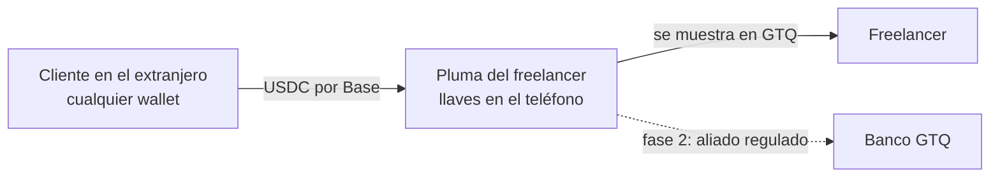

# Pluma 🪶

**Hace mil años, las plumas de quetzal eran dinero. Pluma las trae de vuelta — digitales.**

Wallet **no-custodial** de dólares digitales (USDC en Base) para freelancers guatemaltecos: cobrá al extranjero con un link, mirá todo en quetzales y aprendé cripto sin miedo. Proyecto universitario del curso de Gestión de Proyectos de Ingeniería — corre 100% en **testnet** (dinero de prueba, transacciones reales en blockchain).

| Documento | Contenido |
|---|---|
| [docs/investigacion.md](docs/investigacion.md) | Investigación completa: mercado, competencia (OSMO, Lulubit, Félix…), regulación (Decreto 15-2026), Higgsfield, diseño |
| [docs/plan.md](docs/plan.md) | Plan de producto y proyecto: objetivos, MoSCoW, stack, riesgos, roadmap del semestre |
| [docs/diseno.md](docs/diseno.md) | Sistema de diseño "Bosque nuboso": tokens, tipografía, la firma (pluma), motion |
| [docs/encuesta-freelancers.md](docs/encuesta-freelancers.md) | Instrumento de encuesta para el Estudio de Mercado (n≥50) |

## Correr la app

```bash
npm install
npx expo start
```

- **En tu teléfono (recomendado):** instalá **Expo Go** (gratis, Android/iOS) y escaneá el QR de la terminal. Ambos deben estar en la misma red Wi-Fi.
- **Demo web:** `npx expo start --web` (la web es solo superficie de demo; cámara y biometría viven en el teléfono).

## Fondear con dinero de prueba (para la demo)

1. Creá tu wallet en la app y copiá tu dirección (Ajustes o Fondear).
2. **Gas** (ETH de Base Sepolia): [faucet de Coinbase CDP](https://portal.cdp.coinbase.com/products/faucet) o [Alchemy](https://www.alchemy.com/faucets/base-sepolia).
3. **USDC de prueba**: [faucet oficial de Circle](https://faucet.circle.com) → red **Base Sepolia**.
4. Consejo: fondeá con días de anticipación — los faucets a veces se secan.

## Guion de demo para la clase (2 teléfonos, ~3 minutos)

1. **Teléfono A (freelancer):** crear wallet → mostrar las 12 palabras ("esto ES la cuenta, nadie más la tiene") → PIN.
2. A: **Cobrar** → Q1,900 → "Diseño de logo — anticipo" → se genera el QR + botón *Share in English*.
3. **Teléfono B (el "cliente gringo"):** escanear el QR desde otra wallet (u otra Pluma con Enviar) → confirmar.
4. A: en segundos cae el pago → **"¡Cayó tu cobro!"** con la pluma animada → movimiento con equivalente en quetzales y hash verificable en el explorador.
5. Cerrar con el **Simulador**: "$500/mes por PayPal = ~Q3,700 perdidos al año. Con rieles de dólares digitales: centavos."

## Stack (todo gratuito)

Expo SDK 57 · React Native 0.86 · TypeScript · expo-router · **viem** (BIP-39, firma local) · **Base Sepolia** (USDC de Circle) · zustand · expo-secure-store + biometría · reanimated 4 · lucide + QR SVG · Space Grotesk / Inter. **Sin backend**: la blockchain es la fuente de verdad; $0 de infraestructura.



## Scripts útiles

```bash
npx tsc --noEmit                 # chequeo de tipos
node scripts/gen-assets.mjs      # regenera ícono/splash + optimiza ilustraciones
node scripts/captura.mjs shots   # capturas de pantalla (requiere web sirviendo)
node scripts/e2e-crear.mjs shots # prueba E2E del flujo de creación de wallet
```

## Avisos

- **Versión educativa en testnet**: el saldo es dinero de prueba; no es un servicio financiero ni asesoría.
- La Escuela Cripto es contenido educativo general (no asesoría fiscal); el contexto regulatorio (Decreto 15-2026) está documentado en la investigación.
- Ilustraciones generadas con Higgsfield (Soul 2) según el mini-plan de assets del plan de producto; ícono y elementos de UI son SVG propios.
