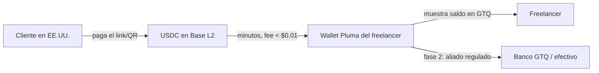
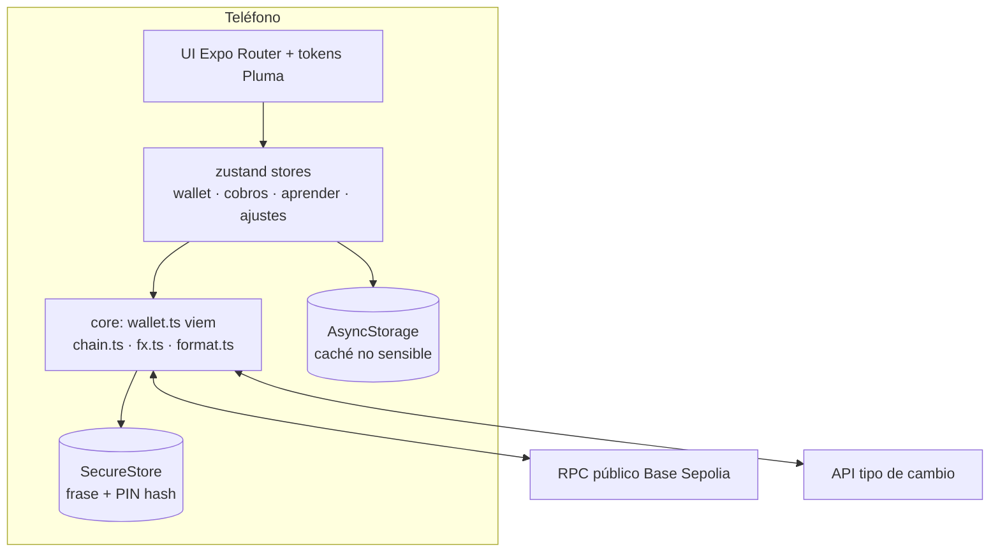

# Pluma — Plan de producto y proyecto
**"Hace mil años, las plumas de quetzal eran dinero. Pluma las trae de vuelta."**

Wallet no-custodial de dólares digitales (USDC) para freelancers guatemaltecos, con links de cobro, mentalidad en quetzales y Escuela Cripto integrada.

> Base: hallazgos de [investigacion.md](investigacion.md) · Sistema de diseño: [diseno.md](diseno.md) · Instrumento de encuesta: [encuesta-freelancers.md](encuesta-freelancers.md)

---

## 1. Visión y enunciado del problema

**Problema (diapositiva):** "El dinero que cruza la frontera hacia o desde Guatemala —ya sea una remesa familiar o el pago a un freelancer— pierde entre 3% y 8% de su valor en comisiones y tipo de cambio, y puede tardar hasta 5 días en llegar, penalizando más a quien menos puede permitírselo."

**Visión:** que cobrar $500 de un cliente en Nueva York sea tan fácil como recibir un Zelle local: en minutos, perdiendo centavos en vez de porcentajes, y sin entregarle la custodia del dinero a nadie.

**Por qué "Pluma":** las plumas de quetzal fueron moneda de intercambio maya (junto al jade y el cacao). El quetzal —que no sobrevive en cautiverio— es la metáfora exacta de una wallet no-custodial: *tu pisto no vive enjaulado en la empresa de nadie*. La narrativa alimenta naming, diseño y pitch.

## 2. Objetivos (SMART, semestre)

| # | Objetivo | Métrica | Meta | Cuándo |
|---|---|---|---|---|
| O1 | Validar el dolor con usuarios reales | Encuestas + entrevistas a freelancers | ≥ 50 encuestas, ≥ 8 entrevistas | Semana 6 |
| O2 | MVP funcional en testnet | Flujo completo crear wallet → cobrar → recibir → ver en GTQ | Demo en vivo sin errores | Semana 10 |
| O3 | Onboarding sin fricción | Tiempo de "instalar → listo para cobrar" | < 3 minutos, sin conocer qué es blockchain | Semana 10 |
| O4 | Costo total por cobro | Fee de red + take rate modelado | < 1% total (vs 2% Recurrente, ~8% PayPal) | Estudio financiero |
| O5 | Educación que convierte | Lecciones completadas por usuario de prueba | ≥ 3 lecciones promedio | Semana 12 |

## 3. Usuario y alcance

- **Primario (MVP):** freelancer guatemalteco que cobra en USD (diseño, dev, marketing, VA). 100% digital, sin red física.
- **Secundario (fase 2, solo evaluación de expansión):** receptor de remesas — requiere red de retiro en efectivo (la parte técnico-industrial con layout/capacidad/logística).
- **Fuera de alcance del semestre:** off-ramp real a banco GTQ (se modela con aliados regulados), custodia de fondos reales (todo corre en **testnet**), multi-red.

## 4. Diferenciadores (el combo, no una feature)

1. **No-custodial de verdad** — las llaves viven en el teléfono (Secure Enclave/Keystore). Pluma nunca puede tocar, congelar ni perder tus fondos. Nadie en el mercado GT lo ofrece (OSMO, Lulubit, Binance: custodiales).
2. **Link de cobro "mandá tu pluma"** — el freelancer comparte un link/QR como comparte su número de cuenta; el cliente paga desde cualquier wallet del mundo. Patrón mental validado por Recurrente, pero sin sus 2% ni el papeleo de formalización, y el dinero queda en dólares del freelancer.
3. **Mentalidad quetzal** — todo se muestra primero en GTQ con el TC del día (referencia Banguat); el USD digital es el motor, no la interfaz. Nadie hace esto: todas las apps te obligan a pensar en cripto.
4. **Escuela Cripto chapina** — micro-lecciones de 1 minuto en voseo, con contexto local real (SAT/FEL, bancos GT, estafas comunes en Guate, Decreto 15-2026). La confianza es LA barrera de adopción; la educación es adquisición, no contenido de relleno.
5. **Compliance-first** — trazabilidad exportable (CSV para tu contador), aviso regulatorio transparente, KYC ligero diseñado para el reglamento que viene. Ventaja frente a incumbentes que tendrán que remendar.

## 5. Funcionalidades (MoSCoW)

### Must (MVP semestre — construido en este repo)
- **Onboarding** 3 pantallas de valor + crear/importar wallet (12 palabras) con respaldo guiado y quiz de verificación.
- **Seguridad**: PIN de 6 dígitos + biometría (Face ID/huella); revelar frase solo re-autenticando; borrado seguro con doble confirmación.
- **Inicio**: balance héroe en GTQ + USDC, TC del día con fuente y hora, acciones rápidas, últimos movimientos agrupados por día.
- **Cobrar (la pluma)**: monto en GTQ o USDC + concepto → genera QR EIP-681 + texto listo para WhatsApp (ES para vos, EN para tu cliente); lista "Mis cobros" con estado pendiente/pagado detectado on-chain.
- **Enviar**: dirección pegada o escaneada (QR), validación, vista previa de fee, confirmación con PIN/biometría, resultado con hash y link al explorador.
- **Recibir**: QR de dirección + copiar en un tap + advertencia de red (patrón referencia D).
- **Actividad**: historial con detalle por transacción (monto USDC, equivalente GTQ al momento, hash, estado, explorador).
- **Aprender**: 12 micro-lecciones en 4 niveles (Semilla→Milpa→Cosecha→Vuelo), quiz por lección, plumas ganadas, progreso visual.
- **Simulador de ahorro**: cuánto perdés al año con PayPal/banco vs Pluma (el gancho del pitch).
- **Fondeo testnet**: pantalla guiada a faucets (USDC de Circle + gas) para la demo.
- **Estados**: carga con skeletons, vacíos con acción, errores con recuperación, offline banner, modo demo seguro (testnet badge).

### Should (si el semestre da)
- Exportar CSV de movimientos; alias legibles ("pluma de Andrea"); modo claro.

### Could (fase 2 — se documenta, no se construye)
- Off-ramp GTQ vía aliado regulado (modelo OSMO/Coincaex), multi-red (patrón visual ya definido), KYC con proveedor, notificaciones push de cobro pagado, recuperación social de llaves.

### Won't (explícito)
- Custodia, trading/especulación, tokens distintos a USDC, tarjeta física.

## 6. Flujos clave

**Cobro:** Inicio → Cobrar → monto+concepto → se genera pluma (QR + link + texto WhatsApp) → cliente paga desde cualquier wallet → push de "¡Cayó tu cobro!" (fase 2: push real; MVP: polling) → movimiento con equivalente GTQ.

**Onboarding:** Splash → 3 value props → Crear wallet → ver 12 palabras (educación inline: "esto ES tu cuenta") → quiz 2 palabras → PIN → biometría opcional → Inicio con checklist "Tus primeros vuelos".

## 7. Stack técnico (100% gratuito, justificado)

| Capa | Elección | Por qué (y por qué no la alternativa) |
|---|---|---|
| Framework móvil | **Expo SDK 57 + React Native 0.86 + TypeScript** | Un código → iOS + Android + web de demo; Expo Go permite demo en teléfonos reales sin cuenta de desarrollador de pago (Apple cobra $99; Expo Go es gratis). Flutter descartado: el ecosistema cripto JS (viem) es muy superior. |
| Navegación | **expo-router** (file-based, typed routes) | Deep links gratis (los links de cobro abren la app), stack/tabs nativos. |
| Cripto core | **viem** | Librería EVM moderna, liviana y tipada; genera mnemónicos BIP-39, firma local y habla con la red. ethers.js descartado: más pesado y API menos segura de tipos. |
| Red | **Base Sepolia (testnet L2 de Coinbase)** | USDC de prueba gratis del faucet oficial de Circle; fees reales < $0.01 en mainnet; RPC público sin API key. La demo es una transacción REAL en blockchain, no un mock. |
| Stablecoin | **USDC (Circle)** | Auditada, faucet de testnet oficial, la misma que usan Félix/Bitso como riel. |
| Estado | **zustand + AsyncStorage** | 1 KB, sin boilerplate; persistencia simple. Redux descartado: overkill. |
| Secretos | **expo-secure-store** (Keychain/Keystore) + PIN hasheado (SHA-256+salt) + **expo-local-authentication** | La frase semilla nunca sale del enclave del teléfono. |
| UI | Sistema propio (tokens + componentes) + **expo-blur / expo-glass-effect** (Liquid Glass nativo en iOS 26) + **react-native-reanimated 4** + **expo-haptics** | Ver [diseno.md](diseno.md). Sin librerías de UI pesadas: el diseño es el diferenciador. |
| Iconos / QR | **lucide-react-native** + **react-native-qrcode-svg** + **expo-camera** | Vectores consistentes; QR generado y escaneado offline. |
| Tipo de cambio | **open.er-api.com** (gratis, sin key) con caché local y valor de respaldo; referencia Banguat documentada | Resiliente offline para la demo. |
| Tipografías | **@expo-google-fonts** Space Grotesk + Inter | Gratis, offline, sin descargas en runtime. |
| Backend | **Ninguno en MVP** (chain = fuente de verdad + almacenamiento local) | $0 de infraestructura y cero datos personales que proteger; Supabase free tier queda documentado para fase 2 (push, KYC, links hospedados). |

**Costo total de infraestructura del MVP: Q0.00.**

## 8. Arquitectura

Principios: la frase semilla solo se toca para firmar/revelar (siempre tras re-auth); nada sensible en AsyncStorage; toda pantalla tiene estado de carga/vacío/error; polling de saldo cada 12 s en foco + pull-to-refresh; detección de cobros pagados vía logs `Transfer` on-chain.

## 9. Modelo financiero (semilla para el Estudio Financiero)

Construcción del take rate desde el costo real (no inventado):

| Componente | Costo |
|---|---|
| Fee de red Base (mainnet, transfer USDC) | ~$0.01 |
| Off-ramp aliado regulado (benchmark P2P/OTC GT) | 0.5–1.0% |
| Margen Pluma objetivo | 0.4–0.75% |
| **Total usuario** | **≈ 1.0–1.75%** vs 2% (Recurrente cripto), ~3% (Payoneer con conversión), ~8% (PayPal) |

Ahorro anual freelancer de $1,000/mes: PayPal ~$960 → Pluma ~$150 ⇒ **~Q6,200 al año que se quedan en Guate** (el número del simulador y del pitch).

## 10. Assets Higgsfield — mini-plan de costos (regla N4: aprobar antes de generar)

| Asset | Sección | Modelo | Specs | Prompt (esencia, ≤75 palabras, luz primero) |
|---|---|---|---|---|
| Hero onboarding 1 "Cobrá al mundo" | Onboarding | Soul (preset minimal/product) | 1:1 1024 | Pluma de quetzal iridiscente flotando sobre teléfono de vidrio oscuro, luz de bosque nuboso desde arriba, paleta jade/teal sobre verde-negro, macro lens, mood premium calmo |
| Hero onboarding 2 "Tus llaves" | Onboarding | Soul | 1:1 1024 | Jade maya tallado + llave moderna de cristal, niebla suave, luz direccional fría, fondo verde noche |
| Hero onboarding 3 "Aprendé" | Onboarding/Aprender | Soul | 1:1 1024 | Polluelo de quetzal estilizado amigable sobre libro de vidrio, luz cálida cacao, fondo bruma jade |
| Estado vacío actividad | Actividad | Soul | 1:1 1024 | Pluma sola cayendo suave en niebla verde, minimal, mucha área negativa |

Reglas: 4 generaciones máx.; si el balance de créditos no alcanza, fallback a ilustraciones SVG propias (el sistema de diseño no depende de estos assets). Íconos/vectores del UI **nunca** se generan con IA.

## 11. Riesgos y mitigaciones (para el acta de constitución)

| Riesgo | Prob. | Impacto | Mitigación |
|---|---|---|---|
| **Regulatorio**: reglamento del Decreto 15-2026 aún no emitido; PSAV = personas obligadas | Alta | Alto | Arquitectura no-custodial; off-ramp solo vía aliados regulados; KYC-ready; riesgo declarado en acta |
| RPC/testnet caída en demo | Media | Alto | 3 RPCs con fallback + caché local + guion de demo con transacción pre-hecha |
| Faucets sin fondos la semana de demo | Media | Medio | Fondear wallets de demo con anticipación (checklist semana 9) |
| Desconfianza del usuario en cripto | Alta | Alto | Escuela Cripto + narrativa "dólares digitales" (no "cripto") + testnet badge honesto |
| Alcance se come el semestre | Media | Alto | MoSCoW estricto; fase 2 documentada pero no construida |
| Pérdida de frase semilla por el usuario | Media | Alto | Respaldo guiado con quiz; educación N2; fase 2: recuperación social |
| Nombre "Pluma" con conflicto de marca | Baja | Bajo | Verificar en Registro de la Propiedad Intelectual antes del proyecto final |

## 12. Enfoque de gestión (híbrido, como pide el curso)

- **Adaptativo (Scrum ligero)** para producto/UX: sprints de 2 semanas, backlog re-priorizado tras cada tanda de entrevistas, demo al final de cada sprint.
- **Predictivo (cascada)** para cumplimiento, presupuesto e inversión: plan de KYC/AML, análisis regulatorio y estudio financiero con hitos fijos.

### Roadmap del semestre
| Semanas | Entregable |
|---|---|
| 1–2 | Acta de constitución (con riesgo regulatorio declarado) + esta investigación |
| 3–5 | Estudio de mercado: encuesta (n≥50) + 8 entrevistas → ajuste de backlog |
| 6–8 | Estudio técnico: métricas del MVP (tiempo de onboarding, capacidad de transacciones, tiempo de conversión) medidas EN la app |
| 9–10 | MVP pulido + guion de demo con dos teléfonos |
| 11–12 | Estudio financiero (take rate construido) + evaluación de expansión (remesas fase 2) |
| 13+ | Presentación final: pitch con simulador de ahorro en vivo |

### Cómo el MVP alimenta cada estudio del curso
- **Mercado:** la encuesta vive en `encuesta-freelancers.md`; la app es el estímulo de las entrevistas.
- **Técnico:** la app instrumenta onboarding (< 3 min), confirmación de cobro (segundos, medible en vivo) y tasa de éxito de transacciones.
- **Financiero:** sección 9 + costos de operación reales ($0 infra MVP; proyección fase 2 con Supabase free→pro y proveedor KYC).

## 13. KPIs del producto (post-semestre)
Activación (wallet creada + primer cobro generado), TTFC (time-to-first-cobro), % cobros pagados < 10 min, lecciones/usuario, NPS, take rate efectivo.

## 14. Decisiones de diseño
Resumen ejecutivo en [diseno.md](diseno.md): identidad "bosque nuboso" dark-first, jade + carmesí + cacao, Space Grotesk/Inter, glass sutil con luz de dosel, la pluma como elemento firma (balance, progreso, éxito, ícono), voseo chapín, anti-genérico documentado con el mapeo replica/adapta de las 4 referencias.
